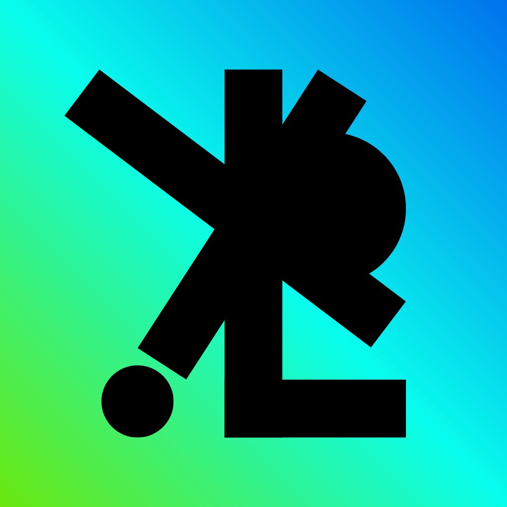

<div align="center">



# KlipKlick

**A fast, keyboard-first clipboard manager that lives in the macOS menu bar.**

[](#install)
[](https://swift.org)
[](#license)

</div>

---

No Dock icon, no ⌘Tab entry. Double-tap ⌘ and a popup opens wherever your
pointer is — type to search, ↩ to paste.

## Features

- **Clipboard history** — text, rich text, links, colours, images, and files, with search and pinning.
- **Keyboard-first** — double-tap ⌘ to open, arrows to move, ↩ to paste, ⌘ 1…9 to grab the *n*th item.
- **Strip formatting** — paste as plain text, with a one-off override while choosing.
- **Colour picker** — sample any pixel on screen, get `#RRGGBB` on the clipboard.
- **Screen text grab** — drag a box over anything readable and copy the *text*, indentation and blank lines intact.
- **⌘ X in Finder** — Windows-style cut and move for files.
- **Menu bar clock** — the time in any zone in the world, with its country's flag.
- **Ignored apps** — per-app opt-out; password managers are skipped automatically.
- **Pinned items persist** — kept encrypted on disk until you clear them; everything else is wiped on quit.

## Install

### Download

Grab the `.dmg` from the [latest release](https://github.com/d-sanoj/KlipKlik/releases/latest),
open it, and drag KlipKlick to Applications.

KlipKlick is ad-hoc signed rather than notarised, so macOS quarantines it on
download and refuses to launch it — usually claiming the app *"is damaged and
can't be opened"*. It is not damaged; that is Gatekeeper reacting to the absent
Developer ID. Clear the quarantine flag once:

```bash
xattr -dr com.apple.quarantine /Applications/KlipKlick.app
```

Then open it normally. It appears in the menu bar, not the Dock — a welcome
window on first launch says so, and offers the two permissions up front.

### Build from source

Requires macOS 14+ and the Xcode Command Line Tools — Xcode itself is not needed.

```bash
git clone https://github.com/d-sanoj/KlipKlik.git
cd KlipKlik
./Scripts/build_app.sh release
```

The result is `build/KlipKlick.app`. A locally built app is not quarantined, so
it launches without the `xattr` step.

### Uninstall

**Settings ▸ Storage ▸ Uninstall KlipKlick…** revokes both permissions, removes
the login item, and deletes every stored setting, then offers to move the app to
the Trash. Dragging the app to the Trash on its own leaves the privacy grants
behind, and macOS matches those by bundle identifier — so a later reinstall
inherits them.

### Tinkering

| | |
| --- | --- |
| `./Scripts/build_app.sh` | Debug build, faster to compile |
| `./Scripts/make_dmg.sh` | Package a disk image |
| `./Scripts/make_icon.sh` | Rebuild the icon after editing `Resources/AppIcon.png` |
| `KLIPKLICK_ICON_RADIUS=0.12` | Tighter icon corners (default `0.18`) |
| `KLIPKLICK_SIGN_IDENTITY="…"` | Sign with a real identity so permissions survive rebuilds |
| `KLIPKLICK_DEBUG=1` | Log every clipboard capture to stderr |

Ad-hoc signatures change on every rebuild, and macOS ties Accessibility and
Screen Recording to the signature — so those grants lapse each time you build
unless you set a signing identity.

## Storage and privacy

Clipboard content is held in memory for five minutes after being copied, then
written to an **AES-GCM encrypted** file and dropped from RAM — an image can be
several megabytes, and holding every one resident is what this avoids. Metadata
stays in memory, so the list still renders and searches without touching disk.

Two tiers, with deliberately different lifetimes:

| | Where | Lifetime |
| --- | --- | --- |
| **Pinned** | `Application Support/KlipKlick` | Until you clear them — survives quit and reboot |
| **Everything else** | `Caches/KlipKlick` | Deleted on quit and at the daily purge |

The encryption key lives in the login Keychain, never beside the files, so
copying the folder elsewhere yields nothing. Both directories are excluded from
Time Machine and Spotlight. Uninstalling deletes the key, which makes anything
missed permanently unreadable.

**Settings ▸ Storage** shows all three figures — memory, cache, archive — and
clears each independently.

## Shortcuts

| | |
| --- | --- |
| `⌘ ⌘` | Open / close the popup |
| `⇧ ⌘ C` | Same, without needing Accessibility |
| `↑` `↓` | Move through history |
| `↩` | Paste the selected item |
| `⌥ ⇧ ↩` | Invert "Strip Format" for one paste |
| `⌘ 1…9` | Paste the *n*th item |
| `⌥ P` | Pin / unpin |
| `⌘ ⌫` | Delete item |
| `⌥ ⌘ ⌫` | Clear history (keeps pinned) |
| `⌘ ,` | Settings |
| `esc` | Close |

## Permissions

| Feature | Needs |
| --- | --- |
| History, search, pinning, the popup | — |
| `⇧ ⌘ C` | — |
| Double-tap ⌘, auto-paste, ⌘ X cut-and-move | Accessibility |
| Screen text grab | Screen Recording |

Grant them in **System Settings ▸ Privacy & Security**.

**Settings ▸ Shortcuts** shows both permissions with a live status dot, and gives
each one its own **Open Settings…** and **Reset permission** button.

> **Note**
> Without a Developer ID certificate the app is ad-hoc signed, and macOS ties
> permissions to the code signature — which changes on every rebuild, silently
> invalidating the grant. The entry in System Settings still looks enabled but
> no longer matches, and toggling it off and on will not fix it; only a reset
> will. Set `KLIPKLICK_SIGN_IDENTITY` to a real signing identity to avoid this
> entirely. Screen Recording additionally needs a relaunch to take effect.

## Development

```
Sources/KlipKlick/
  AppDelegate.swift    Menu bar item, clock, status menu
  Core/                Clipboard monitor, history, capture tools, settings
  UI/                  Popup, preferences, theme
  Models/              Clipboard item capture and classification
Scripts/
  build_app.sh         Compile and assemble the .app
  make_icon.sh         Resources/AppIcon.png -> AppIcon.icns
```

Built with SwiftPM and SwiftUI over a non-activating `NSPanel`, rendered on
macOS 26 Liquid Glass with a graceful fallback to `NSVisualEffectView`.

Contributions welcome — open an issue or a pull request.

## License

[MIT](LICENSE) © Sanoj Doddapaneni
