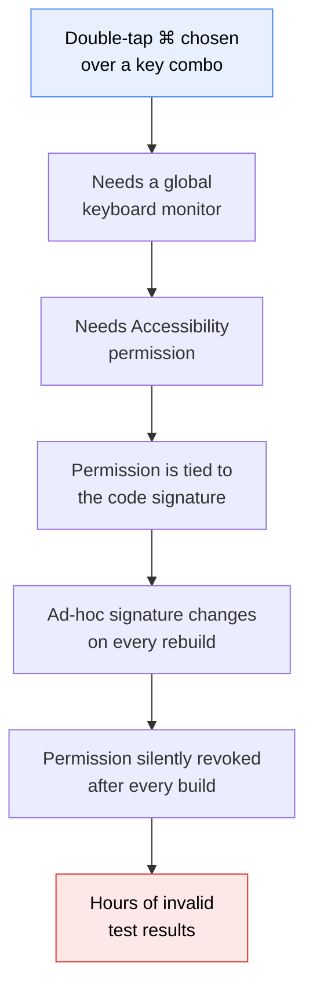

# 01 — The brief, and what the machine could actually do

## The problem

macOS already keeps clipboard history. It is buried behind Spotlight and you
have to go looking for it every time. I wanted the same thing living in the menu
bar, opening wherever my pointer already is, with a keyboard shortcut that works
from anywhere.

The reference was [Maccy](https://github.com/p0deje/Maccy): small, fast, native,
no fluff. Later in the build a proper design file replaced the eyeballed version
(see [03-design-implementation.md](03-design-implementation.md)).

Requirements as stated:

- Status bar only. No Dock icon, no ⌘Tab entry.
- Two-key shortcut that opens the popup at the pointer, from any app.
- Handles every clipboard type, not just text, with a type icon per row.
- Search.
- Light and dark, following the system by default.
- A Preferences window, initially a mockup.

## What the machine could do

First thing I checked, before writing anything:

```
$ sw_vers -productVersion
26.5.2

$ xcodebuild -version
xcode-select: error: tool 'xcodebuild' requires Xcode, but active developer
directory '/Library/Developer/CommandLineTools' is a command line tools instance

$ swift --version
Apple Swift version 6.3.2, Target: arm64-apple-macosx26.0

$ security find-identity -v -p codesigning
0 valid identities found
```

Three constraints fell out of that, and all three shaped the rest of the build.

### No Xcode

Only Command Line Tools. No `.xcodeproj`, no Interface Builder, no Xcode build
system. The CLT SDK does ship the full macOS framework set (AppKit, SwiftUI,
Vision, ScreenCaptureKit, Carbon), so the frameworks were never the issue.

The answer was SwiftPM for compilation plus a shell script that assembles the
`.app` bundle by hand:

```
build/KlipKlick.app/
  Contents/
    Info.plist          ← copied from Resources/
    PkgInfo             ← "APPL????"
    MacOS/KlipKlick     ← the SwiftPM binary
    Resources/AppIcon.icns
```

`Scripts/build_app.sh` does compile → assemble → sign. It has worked for the
whole build without an Xcode project existing.

### No signing identity

`0 valid identities found` meant ad-hoc signing (`codesign --sign -`). At the
time this looked like a footnote. It turned into the single biggest time sink in
the project, and it gets its own file: [05-permissions.md](05-permissions.md).

### macOS 26 on Apple Silicon

An M5, 16 GB, on macOS 26.5.2. That made two frameworks available that would not
be on an older machine:

- `NSGlassEffectView` — real Liquid Glass ([04-liquid-glass.md](04-liquid-glass.md))
- `FoundationModels` — on-device LLM, present in the SDK but reporting
  `appleIntelligenceNotEnabled` at runtime

Deployment target stayed at macOS 14, so both sit behind
`if #available(macOS 26.0, *)` with a fallback path.

## The one question I asked before writing code

The shortcut. I asked rather than picked, because the answer changes the
architecture:

| Choice | Consequence |
| --- | --- |
| A normal key combo (`⇧⌘C`) | Carbon `RegisterEventHotKey`. **No permission needed.** |
| Double-tap `⌘` | Bare modifier. Needs a global keyboard monitor, which macOS gates behind **Accessibility**. |

Double-tap `⌘` was chosen. That single decision is what made Accessibility a hard
dependency, and therefore what made the signing problem matter. `⇧⌘C` was kept as
a second trigger precisely because it needs no permission, so the app is never
completely dead while permissions are missing.

History was also chosen as memory-only, with a forced clear at 5 AM daily.



That chain was not visible at the start. Nothing about "which two keys do you
want" suggests it ends in code signing.

## What got built beyond the brief

The app grew past the original list during the session:

- Pinning, with a separate pinned section
- Strip-formatting on paste, applied at paste time rather than capture time
- Auto-quit other apps when their last window closes
- Windows-style `⌘X` cut-and-move for files in Finder
- Screen text grab — drag a box, get the text out of it
- A colour picker
- A menu-bar clock with time zones
- An onboarding and permissions window

The screen text grab is what led to the OCR work in
[06-ocr-research.md](06-ocr-research.md) and
[07-glyph-repair.md](07-glyph-repair.md), which ended up being the deepest
technical work in the project.
