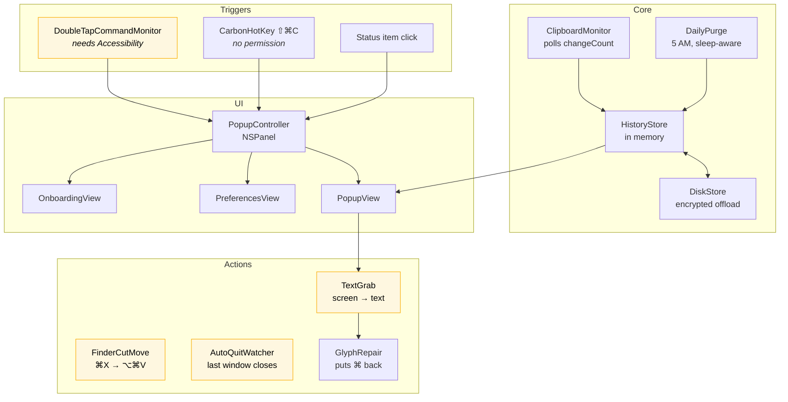
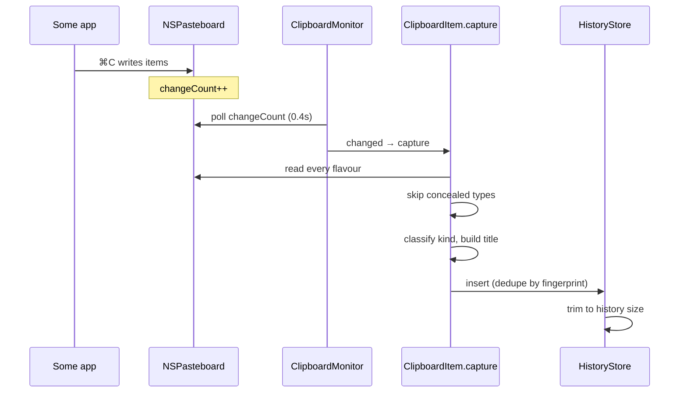
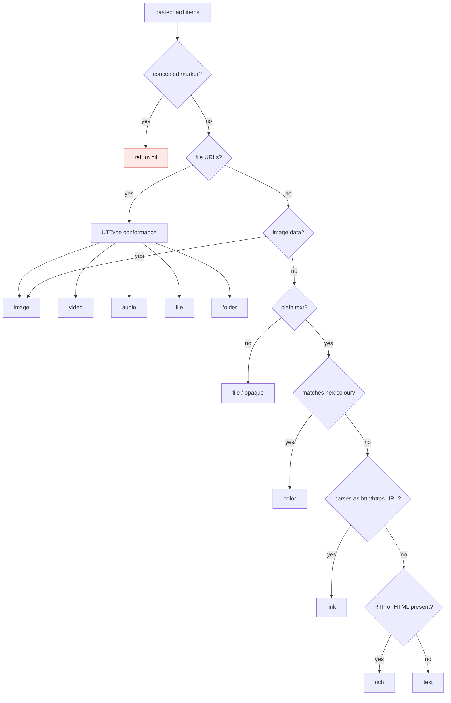
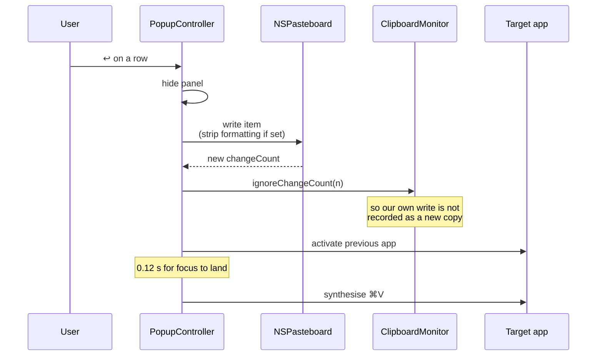

# 02 — Architecture

## Shape of the app

An `NSApplication` with `.accessory` activation policy, so no Dock icon and no
⌘Tab entry. Everything hangs off `AppDelegate`. The popup is a borderless
non-activating `NSPanel` hosting SwiftUI. Preferences and onboarding are ordinary
titled windows.



Yellow means the component does nothing without Accessibility or Screen
Recording. That is most of what makes the app interesting, which is why
permissions mattered so much.

## Capture path

macOS has no notification when the pasteboard changes. The only route is polling
`NSPasteboard.general.changeCount`, which is a counter read rather than a data
read, so it is cheap. KlipKlick polls at 0.4 s.



Two details in there matter more than they look.

**Every flavour is kept, not just the text.** A copy from a rich-text editor
carries RTF, HTML, plain text and sometimes more. `representations` stores all of
them as `[[String: Data]]`, one dictionary per `NSPasteboardItem`. Restoring
writes them all back, so pasting reproduces the original rather than a text-only
approximation. Strip-formatting is then a *choice at paste time* instead of a
lossy decision at capture time.

**Password managers are skipped.** The nspasteboard.org convention marks
transient and concealed content with extra pasteboard types. If any are present,
capture returns `nil` and nothing is recorded.

```swift
private static let concealedMarkers: Set<String> = [
    "org.nspasteboard.ConcealedType",
    "org.nspasteboard.TransientType",
    "org.nspasteboard.AutoGeneratedType"
]
```

### A known limit of polling

Two copies inside the same 0.4 s window collapse into one — only the later is
recorded. This showed up during testing when a script copied items faster than a
human could. Real copying is far slower than the poll, so it stays as a
documented characteristic rather than a bug to fix. Fixing it would mean polling
harder for no practical gain.

## Item classification

Nine kinds, decided from the pasteboard contents in a fixed order.



Order matters. Colour is checked before link because `#0A84FF` would otherwise
never be reached, and rich text is checked last because almost everything that is
rich also has a plain flavour.

Links display with the scheme stripped, so `https://github.com/p0deje/Maccy`
shows as `github.com/p0deje/Maccy`. That came straight from the design file.

## The popup panel

The popup has an unusual requirement: it must take keyboard focus for the search
field, while the app you were typing in stays frontmost so the paste lands
somewhere useful.

That is exactly what a non-activating panel is for:

```swift
final class PopupPanel: NSPanel {
    override var canBecomeKey: Bool { true }
    override var canBecomeMain: Bool { false }
}

styleMask: [.nonactivatingPanel, .borderless, .fullSizeContentView]
collectionBehavior: [.canJoinAllSpaces, .fullScreenAuxiliary, .transient]
```

Keyboard handling uses a local `NSEvent` monitor installed while the panel is
visible, rather than SwiftUI key handling. The search field is first responder,
so arrow keys and Return would otherwise go to the text field and never reach the
list. The monitor intercepts first and returns `nil` to swallow what it handles.

### Height

The panel sizes itself from SwiftUI's ideal height via
`NSHostingController.sizingOptions = [.preferredContentSize]`. SwiftUI resizes
from the bottom-left, so the top edge would crawl up the screen as the list
filters down while you type. `windowDidResize` re-pins the top-left corner to
where it was when the panel opened.

## The paste path



The `ignoreChangeCount` call is what stops restoring an old item from immediately
re-entering history as if it were a fresh copy.

Strip-formatting is an XOR, not a switch:

```swift
let stripFormatting = Settings.shared.stripFormatting != invertFormatting
```

The setting decides the default; holding `⌥⇧` inverts it for one paste. So there
is a one-off escape hatch in whichever direction you need, rather than only ever
being able to strip.

## Daily purge

The requirement was "clear at 5 AM, and still clear it if the Mac was asleep".

A `Timer` cannot do that. Timers do not fire while the machine sleeps, so a
laptop closed overnight sails straight past 5 AM and nothing happens.

The purge never relies on firing at the right moment. Every check recomputes the
most recent 5 AM boundary that has passed and clears if that boundary has not
been handled yet:

```swift
static func mostRecentBoundary(atOrBefore date: Date, hour: Int, calendar: Calendar) -> Date {
    var components = calendar.dateComponents([.year, .month, .day], from: date)
    components.hour = hour
    guard let todayBoundary = calendar.date(from: components) else { return date }
    if todayBoundary <= date { return todayBoundary }
    return calendar.date(byAdding: .day, value: -1, to: todayBoundary) ?? todayBoundary
}
```

Three things trigger a check: a 5-minute timer, `NSWorkspace.didWakeNotification`,
and opening the popup. Open the lid at 09:00 and the wake notification fires the
check, which sees that 05:00 has passed, and clears before you see anything.

## Source layout

```
Sources/KlipKlick/
  main.swift                    NSApplication entry, .accessory policy
  AppDelegate.swift             Status item, clock, triggers, lifecycle
  Models/
    ClipboardItem.swift         Capture, classification, restore
  Core/
    ClipboardMonitor.swift      changeCount polling
    HistoryStore.swift          In-memory store, pinning
    DiskStore.swift             Encrypted offload for large items
    SecretBox.swift             Key handling (0600 file, not Keychain)
    DailyPurge.swift            Sleep-aware 5 AM clear
    DoubleTapCommandMonitor.swift
    CarbonHotKey.swift          Permission-free hot keys
    FinderCutMove.swift         ⌘X cut-and-move
    AutoQuitWatcher.swift       Quit on last window close
    TextGrab.swift              Screen capture → OCR
    GlyphRepair.swift           Puts ⌘ ⌥ ⇧ back
    RegionSelector.swift        Drag-a-box overlay
    ColorSampler.swift          Pixel picker
    Paster.swift                Synthesised keystrokes
    TCC.swift                   tccutil wrapper
    Relauncher.swift            Quit and reopen
    LaunchAtLogin.swift
    Settings.swift              UserDefaults
    Uninstaller.swift
    TimeZoneFlags.swift
  UI/
    PopupController.swift       NSPanel, positioning, keys
    PopupView.swift             Popup layout
    PopupViewModel.swift        Filtering, selection
    ItemRow.swift               Row, hover actions
    IconChip.swift              Per-type glyphs
    HoverDetailCard.swift
    PreferencesView.swift       Five-tab settings
    OnboardingView.swift        Welcome + permissions
    Theme.swift                 Design tokens, glass
```

## Why the store is memory-only

This was a requirement, not a technical choice, but it shapes a lot. There is no
database, no migration, no history file to leak. The trade is that quitting loses
everything, which is stated plainly in the UI rather than hidden.

`DiskStore` looks like a contradiction and is not. Large items (images, mostly)
get offloaded to an encrypted file so RAM does not balloon, and the whole thing
is destroyed at session end. Pinned items are the exception and survive as a
deliberate archive.

`SecretBox` keeps its key in a `0600` file rather than the Keychain. The Keychain
gates access on the code signature, and with an ad-hoc signature that changes
every build, macOS fell back to asking for the login password — repeatedly. An
app that keeps asking for your password trains you to type it into anything that
asks, which is worse than the threat it defends against. Same root cause as
[05-permissions.md](05-permissions.md), different symptom.
