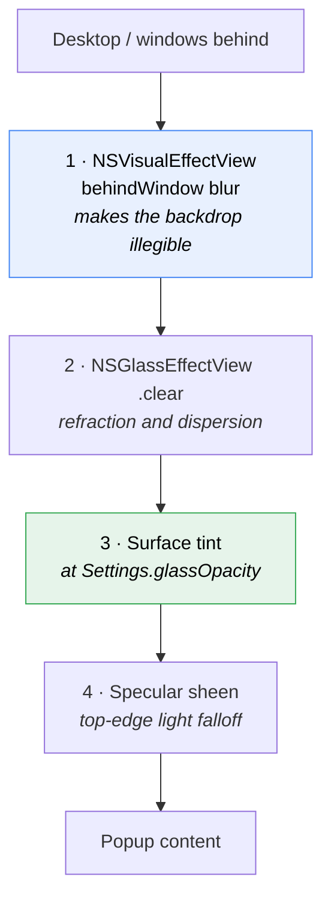

# 04 — Liquid Glass

## The ask

"Remove the thin border and make the background look like glass, where the
content behind is partially visible, around 70% transparency."

macOS 26 has a real material for this. First question was whether the SDK
actually exposes it, rather than assuming and faking it with a blur:

```bash
$ ls "$SDK/System/Library/Frameworks/FoundationModels.framework"  # (separate check)
$ ls "$SDK/System/Library/Frameworks/AppKit.framework/.../NSGlassEffectView.h"
PRESENT
```

The header is small and tells you everything:

```objc
typedef NS_ENUM(NSInteger, NSGlassEffectViewStyle) {
    NSGlassEffectViewStyleRegular,
    NSGlassEffectViewStyleClear
} API_AVAILABLE(macos(26.0));

@interface NSGlassEffectView: NSView
@property (nullable, strong) __kindof NSView *contentView;
@property CGFloat cornerRadius;
@property (nullable, copy) NSColor *tintColor;
@property NSGlassEffectViewStyle style;
@end
```

Deployment target is macOS 14, so it went behind `if #available(macOS 26.0, *)`
with an `NSVisualEffectView` fallback.

## Attempt 1 — `.clear` glass

Removed the hairline border, dropped the opaque background, used `.clear` with a
0.30 tint.

It rendered, and the desktop genuinely came through. It was also close to
unreadable. The text behind the popup was *sharp*, competing directly with the
row text:

```
┌──────────────────────────────────┐
│  Search clipboard history        │
│  T  SELECT * FROM clipboard...   │  ← app text
│ re-grant Accessibility after...  │  ← readable text from behind
│  T  KlipKlick — lightweight...   │
└──────────────────────────────────┘
```

## Attempt 2 — `.regular` glass

Swapped the style. Readable, and effectively opaque. Nothing showed through at
all, which is the opposite of what was asked for.

So the two styles sit at opposite extremes with nothing in between:

| Style | Transparency | Readability |
| --- | --- | --- |
| `.clear` | High | Poor over busy backgrounds |
| `.regular` | Almost none | Good |

## Attempt 3 — `.clear`, fix readability elsewhere

Transparency was the explicit request, so `.clear` stayed. Instead of making the
panel more opaque, I lifted the *text* out of the dimming: un-hovered rows went
from the design's 0.7 to 0.9.

Panel transparency untouched, text more solid. That shipped.

## The user's actual complaint, two turns later

> "I am able to read the text behind the pop up. I dont want like that for
> anything."

That reframed everything. The request was never "make it see-through" in the
literal sense. It was "make it look like glass" — and real glass *diffuses*.
`.clear` Liquid Glass tints but does not blur, so it gives you a window pane,
not frosted glass.

The fix is a layer that actually blurs. `NSVisualEffectView` with
`behindWindow` blending is a genuine gaussian blur of the backdrop.



Order is the whole trick. The blur has to sit *underneath* the glass. Put the
glass on top of sharp content and it refracts sharp content.

Result: backdrop illegible at every setting, glass character retained.

## The opacity slider

Rather than pick a number, the setting became a slider from Clear to Solid,
defaulting to 30%.

Only layer 3 changes as it moves. The blur underneath is constant, so **the
backdrop is illegible at every position** — the slider trades how much colour
bleeds through, never whether text behind can be read.

I deliberately did not swap glass styles across the range. `.regular` is already
near-opaque, so crossing that threshold mid-drag would make the slider jump
instead of sweep. One style throughout, one continuous control.

Verified at both ends by rebuilding with each value and capturing:

| Setting | Result |
| --- | --- |
| 0% | Bare frosted glass, colour and light through, no readable text |
| 30% | Default. Glass character, comfortable contrast |
| 100% | Fully opaque panel, nothing through |

Preferences uses `.regular` and does **not** follow the slider. A dense settings
form on clear glass is unreadable, and if the slider controlled it, dragging
toward Clear would make the very slider you are using illegible.

## Cleanup that followed

Once the glass carried the surface, `popupBackground` and `popupBorder` in the
palette had no callers. I removed them. Keeping a token called
"popup background" that no longer paints the background is worse than having no
token.

`surface` came back one turn later when the slider needed an opaque colour to
composite. Same colour value, different job, and this time it is used.

## Caveat

Tuned against a dark background. The sheen is a fixed white gradient, so over a
bright wallpaper in light mode it may read stronger than intended. The stops are
in `GlassSurface.sheen`.
