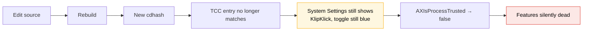
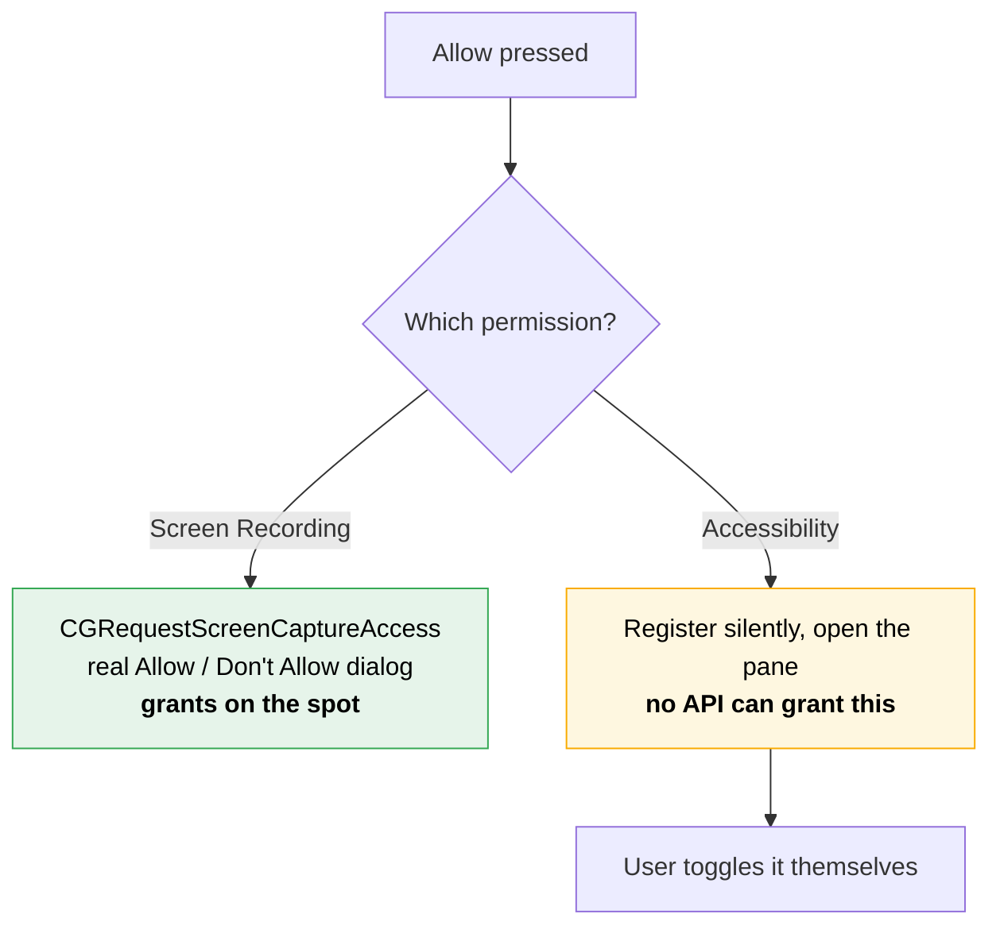

# 05 — Permissions, signing, and the bug that faked every test

This is the file to read if you read nothing else. The technical work was
straightforward. The problem was that for several hours the tests said things
worked when they did not, and I reported a feature as working twice before
catching it.

## What needs what

| Feature | Permission |
| --- | --- |
| Clipboard capture, search, pinning, the popup | none |
| `⇧⌘C` (Carbon hot key) | none |
| Double-tap `⌘` | Accessibility |
| Auto-paste | Accessibility |
| Auto-quit apps | Accessibility |
| `⌘X` cut-and-move | Accessibility |
| Screen text grab | Screen Recording |

Most of the interesting behaviour sits behind Accessibility. That is a direct
consequence of choosing a bare-modifier shortcut back in
[01-brief-and-constraints.md](01-brief-and-constraints.md).

## The mechanism

macOS ties a TCC grant to the app's **code signature**, not its path or bundle
identifier. An ad-hoc signature (`codesign --sign -`) is derived from the
binary's own contents, so it changes whenever the binary changes.



The yellow box is the cruel part. The row stays in System Settings, still
enabled, pointing at a signature that no longer exists. Toggling it off and on
does not fix it. The entry has to be cleared and re-approved.

Measured directly:

```
$ codesign -dvvv build/KlipKlick.app | grep CDHash
CDHash=96fe8bc510abe6b8d2ba26f3c5fd82f2298f6f6c     ← before

# ... source edit, rebuild ...

CDHash=46d2af57aeac31ed9696c58c8ae67897529e86ca     ← after
```

A useful corollary I checked later: rebuilding with **no source change** produces
an identical cdhash, so the grant survives. Packaging the DMG re-signs the app,
and I verified the hash was unchanged before doing it.

## The bug that faked the results

`⌘X` cut-and-move was reported working, twice, with logs:

```
cutmove: saw ⌘X frontmost=com.apple.finder textInput=false
cutmove: armed changeCount=2986 hotKey=true
cutmove: ⌘V intercepted armed=true stale=false move=true
→ src: (empty)   dst: moveme.txt
```

The file moved. The logs were real. The feature did nothing for the user.

Cause: **a binary launched from a terminal that already has Accessibility
inherits that grant.** I was launching the app from the shell to read its stderr
logs. That instance was trusted. The app launched normally from Finder was not.

Proved by writing the permission state to a file at startup and launching both
ways:

```
launched via `open`   (how the user runs it):  trusted=false
launched from my shell (how I tested):         trusted=true
```

Two different processes, same bundle, same moment, opposite answers.

Every "verified working" claim for `⌘X`, auto-quit and double-tap `⌘` was made
against a privileged instance. The code was right the entire time and starved of
the permission it needed.

### What I should have done

Test the app the way it is launched, not the way that is convenient for reading
logs. The convenience *was* the confound. Writing state to
`/tmp/klipklick-trust.txt` made the difference visible in one line, and that
diagnostic stayed in the app because this class of bug is invisible without it.

## The Screen Recording registration bug

Separate bug, same family. The user could not find KlipKlick in the Screen
Recording list to enable it.

```swift
static func promptIfNeverAsked() -> Bool {
    guard !defaults.bool(forKey: askedKey) else { return false }   // ← bails here
    defaults.set(true, forKey: askedKey)
    return !CGRequestScreenCaptureAccess()
}

static func allow() -> Bool {
    if promptIfNeverAsked() { return true }
    openSettingsPane()     // opens a list with no KlipKlick row in it
    return false
}
```

`CGRequestScreenCaptureAccess()` is what *registers the app in the list*. The
"only ask once" guard, added to avoid nagging, skipped the exact call that
creates the row. And because list entries are tied to the signature, every
rebuild removed the row with nothing ever re-adding it.

Confirmed before changing anything:

```
$ defaults read com.sanoj.KlipKlick didAskForScreenRecording
1
```

Fix — always make the request, every time:

```swift
static func allow() -> Bool {
    // The request is what registers the app in the list, and the entry is tied
    // to the code signature, so updating removes the row. macOS still only
    // raises the dialog once; afterwards this just re-registers.
    let granted = CGRequestScreenCaptureAccess()
    UserDefaults.standard.set(true, forKey: askedKey)
    guard !granted else { return true }
    openSettingsPane()
    return false
}
```

## The self-signed certificate, and why it failed

The proper fix for signature churn is a stable signing identity. I tried one.

```bash
openssl req -x509 -newkey rsa:2048 -nodes -keyout key.pem -out cert.pem \
  -days 3650 -config openssl.cnf -extensions v3     # codeSigning EKU
openssl pkcs12 -export -inkey key.pem -in cert.pem -out identity.p12 ...
security import identity.p12 -k ~/Library/Keychains/login.keychain-db \
  -P klipklick -T /usr/bin/codesign -A
```

Imported, but not trusted:

```
1) CED295A0... "KlipKlick Self-Signed" (CSSMERR_TP_NOT_TRUSTED)
```

After `security add-trusted-cert -r trustRoot -p codeSign`:

```
1) CED295A0... "KlipKlick Self-Signed"
   1 valid identities found
```

Then signing failed anyway:

```
build/KlipKlick.app: errSecInternalComponent
```

That is codesign unable to reach the private key. `security
set-key-partition-list` ran and returned 0, and the error persisted.

Abandoned. The certificate and its trust setting were removed from the keychain
rather than left as clutter in the user's security configuration:

```
$ security find-identity -p codesigning | grep -i klipklick
none (clean)
```

A self-signed certificate would not have helped distribution anyway — Gatekeeper
rejects it just as firmly as ad-hoc. See
[09-distribution.md](09-distribution.md).

## What shipped instead

Since the churn could not be eliminated, the app makes it visible and fixable.

**A permissions window instead of the bare system alert.** The macOS
Accessibility alert has no icon, no account of what it unlocks, and no way back
once dismissed. It now appears in KlipKlick's own window, in one of two modes:

| | First run | Permission missing later |
| --- | --- | --- |
| Heading | Welcome to KlipKlick | KlipKlick needs permission |
| Body | Where it lives, how to open it | What is off, and that the grant lapsed because the signature changed |
| Button | Start Using KlipKlik | Done / Restart |

**One Allow button each, doing the most that is possible.**



Accessibility cannot be granted programmatically. `AXIsProcessTrustedWithOptions`
raises an alert whose only action is "Open System Settings" — it grants nothing.
Showing it costs a click and offers no choice, so the button now registers the
app silently and opens the pane directly. The window says so in plain words
rather than letting the button imply more than it does.

**A Reset permission button.** Runs `tccutil reset` for the app's bundle
identifier and re-asks. This is the only thing that fixes a stale row, and it can
only ever revoke — re-approval still goes through the system.

**A Restart button.** A grant made while the app is running does not reach the
parts that need it. Monitors, Carbon hot keys and event taps are claimed at
launch, and macOS only hands them to a process that was already trusted when it
asked. Re-checking `AXIsProcessTrusted` reports the new answer while the features
stay dead.

The relauncher waits for the old process to exit before reopening:

```sh
while kill -0 "$1" 2>/dev/null; do sleep 0.1; done; exec /usr/bin/open "$2"
```

Launching first and quitting after would let macOS reactivate the running copy
instead of starting a fresh one, and two instances would each claim the same hot
keys.

### One more measurement that changed the design

The restart button first appeared only when a permission change was *observed*.
It never appeared.

`CGPreflightScreenCaptureAccess()` caches its answer for the life of the
process. Grant Screen Recording and the running app still reads `false`. Waiting
for the observed flip meant the button never changed for the one permission that
most needs a restart.

Now it keys off the user having *asked*, not off a confirmed change.

## Final state

Both permissions granted, verified on a normally launched app:

```
$ cat /tmp/klipklick-trust.txt
trusted=true pid=73606
```

And `⌘X` cut-and-move, tested twice on that instance:

```
run 1 -> Documents: MOVED
run 2 -> Documents: MOVED
```

The feature had been correct since it was written. It took this long to prove
because the test environment was quietly more privileged than the real one.
