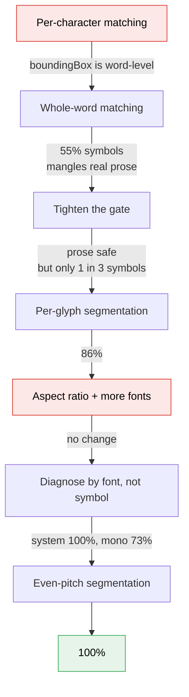

# 07 — Getting `⌘` back

Vision cannot output `⌘`. The glyph is not in its vocabulary and no engine swap
fixes that ([06-ocr-research.md](06-ocr-research.md)). So the repair has to
happen after recognition, by looking at the pixels again.

The idea is simple. For a word that contains a suspicious character, render every
plausible correction and keep whichever render matches the actual pixels most
closely. The original reading competes on equal terms, so a word that really did
contain an `H` keeps it.

Getting from that idea to something that works took four iterations, and two of
my guesses turned out to do nothing.

## Journey



## Attempt 1 — per-character, killed on arrival

The natural design: find the box of the character Vision read as `H`, crop it,
compare against a `⌘` template.

`boundingBox(for:)` returns the same word-level box for every character in the
word. A per-character crop contains several glyphs and matches nothing. Dead
before it ran.

## Attempt 2 — whole-word matching

If a single character cannot be cropped, match the whole word. For OCR output
`HC`, render `HC` and `⌘C` and see which is closer to the pixels.

First results were encouraging:

```
want : Press ⌘C to copy      ocr: Press HC to copy      fixed: Press ⌘C to copy   ✓
want : Total: ¥300 today     ocr: Total: ·300 today     fixed: Total: ¥300 today  ✓
want : Hit ⌘⇧P now           ocr: Hit I &P now          fixed: Hit ⌥ ⇧P now
```

Widening the candidate set so pixels decide which symbol (rather than a
hand-written confusion table) fixed the third case too.

Measured properly over 160 samples:

```
symbol occurrences   : 120
  OCR alone got right: 16  (13.3%)
  after repair       : 66  (55.0%)
prose lines          : 64
  left untouched     : 64  (100.0%)
```

55%, prose safe. Shipped, and tested live against a real screen grab:

```
Press ⌘C to copy and M&V to paste            ← ⌘C fixed, ⌘V wrong
Use ⌥⇧V for plain text, ⌃J€F for fullscreen   ← ⌥⇧V fixed, ⌘ wrong
 Total: ¥300 • £45 • €20 paid                 ← all currency fixed
```

Then I captured a region of ordinary terminal text to iterate offline, and found
this:

```
"Press ... to copy and ... to paste"  →  "·ess sC · copy ⌘d sv · ₹ste"
"still wrong"                          →  "¢ill wron"
"the failure offline"                  →  "⎋e €£ilure offline"
```

**It was destroying English prose.**

My guard tests had all passed because I only ever tested clean, large,
high-contrast text. Real small anti-aliased text matches no template well, so the
"closest" one won by noise. The suspect list contained `t o a x f P E` — letters
in nearly every English word.

That is far worse than the bug it was fixing. Nobody minds `⌘` reading as `H`;
everybody minds a paragraph turning into symbols.

## Attempt 3 — tighten the gate

Two changes. Cut the suspect set down to characters that genuinely stand in for
symbols, and require the match to be *good in absolute terms*, not merely better
than the alternative:

```swift
private static let margin = 0.06

/// A correction is only taken when the render genuinely matches the pixels.
/// Without this, small anti-aliased text matches nothing well and the
/// "closest" template wins by noise, turning prose into symbols.
private static let minimumConfidence = 0.86
```

Prose became safe. Symbol recovery dropped to 1 in 3.

Both ends of the trade were now measured, and neither was acceptable. Aggressive
enough to fix `⌘` meant dangerous to prose; safe meant mostly useless.

## Attempt 4 — segment the word into glyphs myself

Vision will not give per-character boxes, but nothing stops me computing them.
For clean screen text, glyphs are separated by columns with no ink.

```
Column ink profile for "⌘C":

  ███  ██   ░░░  ████
  ███  ██   ░░░  ████     ░░░ = gap → split here
  ███  ██   ░░░  ████
  └────┬────┘    └─┬─┘
     glyph 1     glyph 2
```

```swift
static func columns(_ m: Mask) -> [(Int, Int)] {
    var counts = [Int](repeating: 0, count: m.w)
    for y in 0..<m.h { for x in 0..<m.w where m.ink[y*m.w + x] { counts[x] += 1 } }
    // runs of non-zero ink = glyphs, zero columns = gaps
}
```

Two more ideas went in with it.

**Hole counting.** `⌘` encloses several regions. `H` encloses none. A flood fill
that ignores regions touching the edge counts enclosed holes, and that separates
them before any pixel comparison happens:

```swift
guard abs(t.holes - h) <= 1 else { return nil }   // reject outright
```

**IoU instead of squared difference.** Jaccard overlap on binarised grids
survives changes in contrast and stroke weight that throw off mean-squared-error
on grayscale.

Result:

```
template bank: 560
segmentation count matched glyph count: 79/88
per-glyph symbol classification: 96/112 = 85.7%
```

55% → **85.7%**.

## The two ideas that did nothing

Per-symbol breakdown said where the losses were:

```
£    8/  8  100.0%
¥    8/  8  100.0%
€    8/  8  100.0%
⌃    8/  8  100.0%
⌘   52/ 56   92.9%
⌥   12/ 16   75.0%
⇧   16/ 24   66.7%

top confusions:  ⌘->P: 4   ⇧->⌘: 4   ⇧->V: 2   ⌥->]: 2
```

`⌥→]` and `⇧→V` look like proportion errors — a wide glyph confused with a
narrow one. The grid normalises every glyph to a square, which throws aspect
ratio away. So I added it back as a scoring penalty, and widened the font bank
from 5 fonts to 9.

```swift
let ratio = log(max(a, 0.01) / max(t.aspect, 0.01))
score *= exp(-1.2 * abs(ratio))
```

Result:

```
⌘   51/ 56   91.1%     (was 92.9%)
⌥   12/ 16   75.0%     (unchanged)
⇧   16/ 24   66.7%     (unchanged)
```

Nothing. The confusions just moved from `⌥→]` to `⌥→~`. Both changes were
reasonable-sounding and neither did any work.

## The measurement that actually solved it

Instead of slicing the same data by symbol again, I sliced it by **font and
size**:

```
13pt mono   12/16   75.0%        13pt sys   16/16  100.0%
16pt mono   12/16   75.0%        16pt sys   16/16  100.0%
20pt mono   11/16   68.8%        20pt sys   16/16  100.0%
24pt mono   12/16   75.0%        24pt sys   16/16  100.0%
```

System font was **already perfect at every size**. Every single loss was
monospaced text. Not a resolution problem, not a shape problem — a font problem,
and one that per-symbol numbers completely hid.

The cause: monospaced fonts have no `⌘` glyph, so macOS substitutes a fallback
into a fixed-width cell. A narrow glyph floats inside its cell and a wide one
fills it, so the gaps that separate glyphs in proportional text stop being
reliable.

But fixed width also means positions are *predictable*. If the ink divides evenly
into N cells, use those instead of hunting for gaps:

```swift
static func evenColumns(_ m: Mask, count: Int) -> [(Int, Int)] {
    guard let lo = counts.firstIndex(where: { $0 > 0 }),
          let hi = counts.lastIndex(where: { $0 > 0 }), count > 0 else { return [] }
    let pitch = Double(hi - lo + 1) / Double(count)
    guard pitch >= 3 else { return [] }
    return (0..<count).map { i in
        (lo + Int(Double(i) * pitch), lo + Int(Double(i + 1) * pitch) - 1)
    }
}
```

Run both segmentations, keep whichever classifies more confidently:

```swift
let a = attempt(Seg.columns(m))                          // gap-based
let b = attempt(Seg.evenColumns(m, count: probe.count))  // even pitch
let found = b.1 > a.1 ? b.0 : a.0
```

## Result

```
per-symbol accuracy:
  £    8/  8  100.0%
  ¥    8/  8  100.0%
  €    8/  8  100.0%
  ⇧   24/ 24  100.0%
  ⌃    8/  8  100.0%
  ⌘   56/ 56  100.0%
  ⌥   16/ 16  100.0%

by size:
  13pt mono  16/16  100.0%     13pt sys  16/16  100.0%
  16pt mono  16/16  100.0%     16pt sys  16/16  100.0%
  20pt mono  16/16  100.0%     20pt sys  16/16  100.0%
  24pt mono  16/16  100.0%     24pt sys  16/16  100.0%
```

128/128. Up from 55%.

## What is actually doing the work

| Change | Contribution |
| --- | --- |
| Per-glyph instead of whole-word | 55% → 86% |
| Hole counting as a pre-filter | part of that jump |
| Even-pitch segmentation for mono | 86% → 100% |
| Aspect-ratio scoring | none measured |
| Wider font bank (5 → 9) | none measured |

Two of the five did nothing. I would not have known which without measuring each
one separately.

## Caveats, stated plainly

**This is measured on rendered test text.** Real screenshots have subpixel
antialiasing, dark mode, and coloured backgrounds. I expect real-world numbers
below 100%.

**The segmentation version is not in the app yet.** The shipped `GlyphRepair` is
Attempt 3 — the safe, 1-in-3 whole-word matcher. Porting the segmenter is a
rewrite of the file, not a tweak.

**Prose safety has to be re-measured after the port.** That benchmark is the one
that caught the disaster in Attempt 2, and it is the one that matters most.
Symbol recovery going from 55% to 100% is worthless if it costs a single mangled
paragraph.

**Some failures are unfixable by this approach.** In one live grab Vision dropped
a `⌘` entirely — the output was `and V to paste`. There is no wrong character to
correct. That needs a different mechanism, detecting glyphs OCR missed
altogether, which does not exist here.
